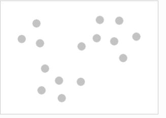
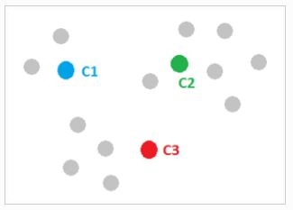
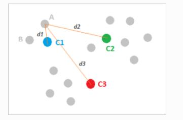
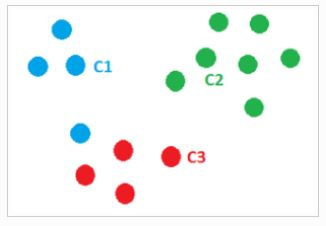
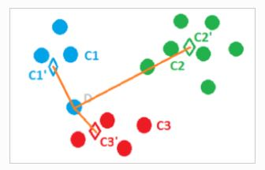
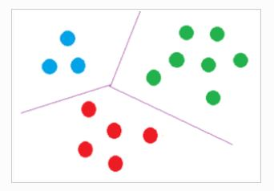

<!-- README.md is generated from README.Rmd. Please edit that file -->

```{r, include = FALSE}
knitr::opts_chunk$set(
  collapse = TRUE,
  comment = "#>"
)
```
# Customer Segmentation 

Customer Segmentation is one of the basic Machine Learning applications where companies can categorize their customers and find the optimal sales niche or group.

We will start by explaining a little about what customer segmentation means, then we will analyze the database, we will know columns, patterns, etc. and finally we will implement the famous k-means algorithm.

## What is Customer Segmentation?

Customer Segmentation is the analysis carried out by all companies to differentiate their customers by groups such as age, gender, preferences, etc., and thus be able to focus their marketing efforts in a more specialized way.

## Data exploration

We will use functions like: str(), names(), head() and summary() to get basic information from the database. This is how they look:

### Column names 
```{r , echo = FALSE,warning=FALSE,message=FALSE}
library(dplyr)
library(ggplot2)
library(tidyverse)
library(plotrix)
library(RColorBrewer)
library(purrr)
library(cluster)
library(factoextra)
library(gridExtra)
library(grid)
library(NbClust)
library(FactoMineR)


cstmrs<-read.table("sc.csv",header=T,sep=",")
#Column names 
names(cstmrs)

```
### Structure

```{r , echo = FALSE,warning=FALSE,message=FALSE}
#Structure
str(cstmrs)

```
### Headers

```{r , echo = FALSE,warning=FALSE,message=FALSE}

#Headers
head(cstmrs)

```
### Data summary

```{r , echo = FALSE,warning=FALSE,message=FALSE}

#Data summary
summary(cstmrs)

```

## Data visualization 

We will create a histogram and boxplot to look at the differences in the distributions of gender, age, annual income, and spending score.

```{r , echo = FALSE,warning=FALSE,message=FALSE}


plot(factor(cstmrs$Gender), main = "Gender Comparison",
     xlab = "Genders", ylab = "Frequency",col=brewer.pal(n = 3, name = "Pastel1"))


tb<-table(cstmrs$Gender)
pct<-round(tb/sum(tb)*100)
lbls<-paste(c("Female","Male")," ",pct,"%",sep = "")


pie3D(tb ,labels=lbls,main = "Gender Comparison",
     col=brewer.pal(n = 3, name = "Pastel1"))


hist(cstmrs$Age, freq = TRUE, main = "Histogram of age class",
     xlab = "Age class", ylab = "Frequency",col=brewer.pal(n = 5, name = "Pastel1"),labels=TRUE)


boxplot(cstmrs$Age, freq = TRUE, main = "Boxplot for descriptive analysis of Age",
     ylab = "Age class",col=brewer.pal(n = 5, name = "Pastel1"),labels=TRUE)


hist(cstmrs$Spending.Score..1.100., freq = TRUE, main = "Histogram of Spending Score",
     xlab = "Spending score class", ylab = "Frequency",col=brewer.pal(n = 5, name = "Pastel1"),labels=TRUE)


boxplot(cstmrs$Spending.Score..1.100., freq = TRUE, main = "Boxplot for descriptive analysis of Spending Score",
        ylab = "Spending score class",col=brewer.pal(n = 5, name = "Pastel1"),labels=TRUE)


plot(density(cstmrs$Annual.Income..k..), main = "Density Plot for Annual Income",
     xlab = "Annual Income Class", ylab = "Density",col=brewer.pal(n = 3, name = "Pastel1"))
polygon(density(cstmrs$Annual.Income..k..), col="red", border="blue")

```

## K-Means 


### How groups are created

Its base is as follows:
We start from a series of observations distributed in space according to their distance matrix.

```{r , echo = FALSE,warning=FALSE,message=FALSE}



```

A series of points are randomly chosen, which may or may not belong to the data set. As many points as groups — clusters —. These points act as centroids. They will be the "center of the universe" for that class in that iteration.

```{r , echo = FALSE,warning=FALSE,message=FALSE}



```

The observations will be assigned to the closest centroid...

```{r , echo = FALSE,warning=FALSE,message=FALSE}



```

…creating a first classification of the first iteration.


```{r , echo = FALSE,warning=FALSE,message=FALSE}



```

The centroids are then computed again, this time as the midpoint of each class.

That is, the average distance between all the points belonging to a class is calculated and the observations are reassigned to the closest centroid —the new centroid—.


```{r , echo = FALSE,warning=FALSE,message=FALSE}



```

This will be repeated until there is convergence, which means that there will be no new reassignments or until the maximum number of fixed iterations is reached, thus generating a classification of the observations in homogeneous groups.

```{r , echo = FALSE,warning=FALSE,message=FALSE}


```