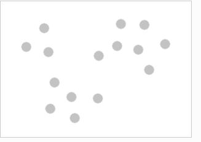
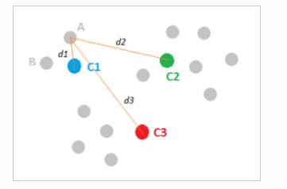
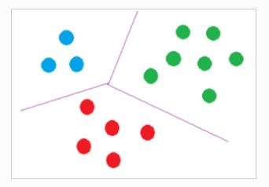
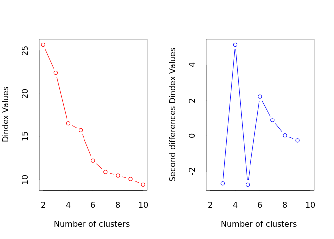
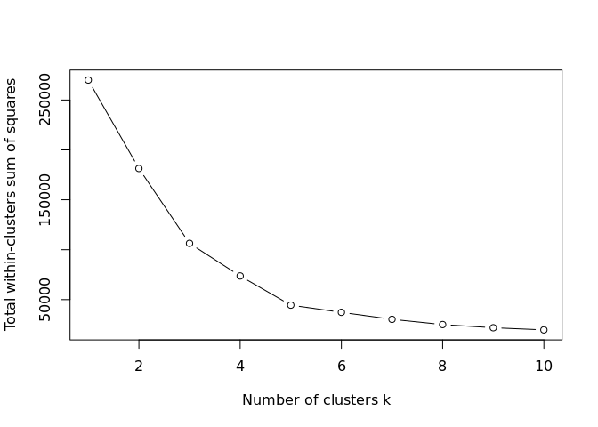
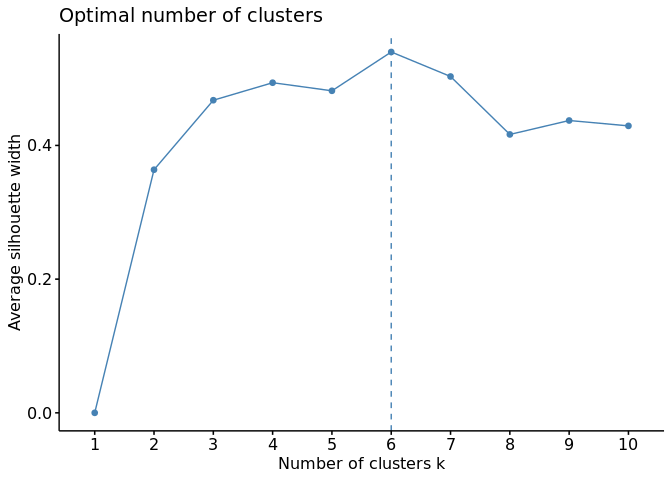
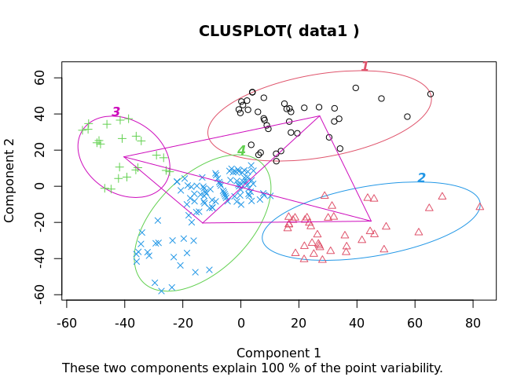

<!-- README.md is generated from README.Rmd. Please edit that file -->

# Customer Segmentation

Customer Segmentation is one of the basic Machine Learning applications
where companies can categorize their customers and find the optimal
sales niche or group.

We will start by explaining a little about what customer segmentation
means, then we will analyze the database, we will know columns,
patterns, etc. and finally we will implement the famous k-means
algorithm.

## What is Customer Segmentation?

Customer Segmentation is the analysis carried out by all companies to
differentiate their customers by groups such as age, gender,
preferences, etc., and thus be able to focus their marketing efforts in
a more specialized way.

## Data exploration

We will use functions like: str(), names(), head() and summary() to get
basic information from the database. This is how they look:

### Column names

    #> [1] "X"                      "CustomerID"             "Gender"                
    #> [4] "Age"                    "Annual.Income..k.."     "Spending.Score..1.100."

### Structure

    #> 'data.frame':    200 obs. of  6 variables:
    #>  $ X                     : int  1 2 3 4 5 6 7 8 9 10 ...
    #>  $ CustomerID            : int  1 2 3 4 5 6 7 8 9 10 ...
    #>  $ Gender                : chr  "Male" "Male" "Female" "Female" ...
    #>  $ Age                   : int  19 21 20 23 31 22 35 23 64 30 ...
    #>  $ Annual.Income..k..    : int  15 15 16 16 17 17 18 18 19 19 ...
    #>  $ Spending.Score..1.100.: int  39 81 6 77 40 76 6 94 3 72 ...

### Headers

    #>   X CustomerID Gender Age Annual.Income..k.. Spending.Score..1.100.
    #> 1 1          1   Male  19                 15                     39
    #> 2 2          2   Male  21                 15                     81
    #> 3 3          3 Female  20                 16                      6
    #> 4 4          4 Female  23                 16                     77
    #> 5 5          5 Female  31                 17                     40
    #> 6 6          6 Female  22                 17                     76

### Data summary

    #>        X            CustomerID        Gender               Age       
    #>  Min.   :  1.00   Min.   :  1.00   Length:200         Min.   :18.00  
    #>  1st Qu.: 50.75   1st Qu.: 50.75   Class :character   1st Qu.:28.75  
    #>  Median :100.50   Median :100.50   Mode  :character   Median :36.00  
    #>  Mean   :100.50   Mean   :100.50                      Mean   :38.85  
    #>  3rd Qu.:150.25   3rd Qu.:150.25                      3rd Qu.:49.00  
    #>  Max.   :200.00   Max.   :200.00                      Max.   :70.00  
    #>  Annual.Income..k.. Spending.Score..1.100.
    #>  Min.   : 15.00     Min.   : 1.00         
    #>  1st Qu.: 41.50     1st Qu.:34.75         
    #>  Median : 61.50     Median :50.00         
    #>  Mean   : 60.56     Mean   :50.20         
    #>  3rd Qu.: 78.00     3rd Qu.:73.00         
    #>  Max.   :137.00     Max.   :99.00

## Data visualization

We will create a histogram and boxplot to look at the differences in the
distributions of gender, age, annual income, and spending score.

<!-- --><!-- --><!-- --><!-- --><!-- --><!-- --><!-- -->

## K-Means

### How groups are created

Its base is as follows: We start from a series of observations
distributed in space according to their distance matrix.

<!-- -->

A series of points are randomly chosen, which may or may not belong to
the data set. As many points as groups — clusters —. These points act as
centroids. They will be the “center of the universe” for that class in
that iteration.

<!-- -->

The observations will be assigned to the closest centroid…

<!-- -->

…creating a first classification of the first iteration.

<!-- -->

The centroids are then computed again, this time as the midpoint of each
class.

That is, the average distance between all the points belonging to a
class is calculated and the observations are reassigned to the closest
centroid —the new centroid—.

<!-- -->

This will be repeated until there is convergence, which means that there
will be no new reassignments or until the maximum number of fixed
iterations is reached, thus generating a classification of the
observations in homogeneous groups.

<!-- -->

## Determine the cluster number

In this case will determine the cluster number using the annual income
vs the spending score this with 3 different methods.

    #>   Annual.Income..k.. Spending.Score..1.100.
    #> 1                 15                     39
    #> 2                 15                     81
    #> 3                 16                      6
    #> 4                 16                     77
    #> 5                 17                     40
    #> 6                 17                     76

### Cluster with Hubert Index

<!-- -->

    #> *** : The Hubert index is a graphical method of determining the number of clusters.
    #>                 In the plot of Hubert index, we seek a significant knee that corresponds to a 
    #>                 significant increase of the value of the measure i.e the significant peak in Hubert
    #>                 index second differences plot. 
    #> 

<!-- -->

    #> *** : The D index is a graphical method of determining the number of clusters. 
    #>                 In the plot of D index, we seek a significant knee (the significant peak in Dindex
    #>                 second differences plot) that corresponds to a significant increase of the value of
    #>                 the measure. 
    #>  
    #> ******************************************************************* 
    #> * Among all indices:                                                
    #> * 4 proposed 2 as the best number of clusters 
    #> * 1 proposed 3 as the best number of clusters 
    #> * 8 proposed 4 as the best number of clusters 
    #> * 8 proposed 6 as the best number of clusters 
    #> * 2 proposed 10 as the best number of clusters 
    #> 
    #>                    ***** Conclusion *****                            
    #>  
    #> * According to the majority rule, the best number of clusters is  4 
    #>  
    #>  
    #> *******************************************************************

### Elbow method with iterative kmeans

<!-- -->

### Silhouette method

<!-- -->

### Visualization of clusters

<!-- -->
